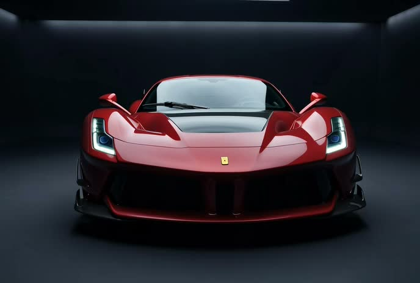

# Ferrari LaFerrari Showcase 🏎️💨

> A premium, scroll-controlled interactive showcase for the Ferrari LaFerrari (Rosso Corsa).
> **Objective**: Production-ready, Awwwards-style scrollytelling experience.

 
*(Note: Screenshot placeholder)*

## 🌟 Overview

This project is a high-performance single-page application that orchestrates a 3D car rotation sequence synchronized with a HUD-style information overlay. The core mechanic relies on a master scroll architecture that locks the viewport for `600vh`, giving users precise control over the 172-frame rotation while revealing technical specifications in distinct phases.

## 🛠️ Tech Stack

- **Framework**: [Next.js 14+](https://nextjs.org/) (App Router, TypeScript)
- **Styling**: [Tailwind CSS v4](https://tailwindcss.com/) (using `@theme` variables)
- **Animation**: [Framer Motion](https://www.framer.com/motion/) (Scroll hooks & layout transitions)
- **Core Logic**: HTML5 Canvas + `requestAnimationFrame` for high-performance image sequencing.

## ✨ Key Features

- **Master Scroll Architecture**: A sticky `600vh` container locks the scroll to the sequence, preventing desync between the visual canvas and the HUD.
- **High-Performance Canvas**: 
  - Batched preloading with staggered network requests (10ms delay) to prevent congestion.
  - Off-screen buffer rendering.
  - Retina/4K display support via `devicePixelRatio` scaling.
- **Synchronized HUD Phases**: 
  - **Hero (0-20%)**: Intro & CTA.
  - **Design (40-60%)**: Active Aerodynamics & Monocoque details.
  - **Engine (80-100%)**: V12 Hybrid specs.
  - Phases use strict `display: none` logic to ensure no visual overlap.
- **Premium Aesthetic**: Custom `Ferrari Red`, `Carbon Gray`, and glassmorphism UI elements using `Orbitron` and `Rajdhani` fonts.

## 🚀 Getting Started

1.  **Clone the repository**:
    ```bash
    git clone https://github.com/Shubhansh28/ferrari-showcase.git
    cd ferrari-showcase
    ```

2.  **Install dependencies**:
    ```bash
    npm install
    ```

3.  **Run the development server**:
    ```bash
    npm run dev
    ```

4.  **Open locally**:
    Navigate to [http://localhost:3000](http://localhost:3000).

## 📂 Project Structure

```
├── app/
│   ├── globals.css         # Tailwind v4 theme & global styles
│   ├── layout.tsx          # Orbitron/Rajdhani font setup
│   └── page.tsx            # Master scroll orchestrator
├── components/
│   ├── FerrariScrollCanvas.tsx  # 3D rotation logic
│   ├── FerrariExperience.tsx    # HUD overlay orchestration
│   └── Navbar.tsx               # Glassmorphism header
├── public/
│   └── images/             # 172-frame JPG sequence
└── data/
    └── carData.ts          # Static content
```

## 🏎️ Design & Performance Details

- **Responsive Design**: Fully responsive layout that adapts the HUD and canvas scaling for different viewports.
- **Font Optimization**: Uses `next/font/google` for zero layout shift.
- **Asset Optimization**: Images served from `public` with efficient preloading strategies.

---

**Made with 💡 & 🏎️ by [Shubhansh28](https://github.com/Shubhansh28)**
